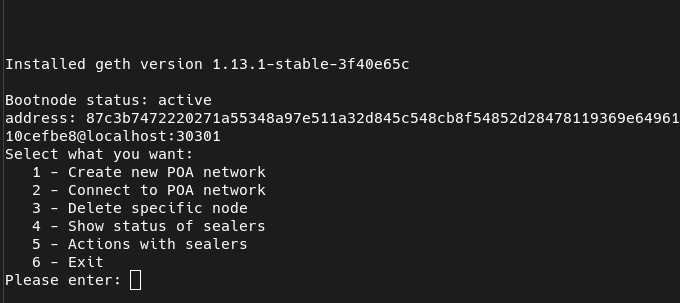

# ManageGeth



Tool for create and connect for existing POA networks

A convenient script for setting up a POA network based on geth. You can launch your blockchain network in 5 minutes. Everything is done through a dialog, so the likelihood of making a mistake is significantly reduced.

What it can do:

* Install all the usual binaries
* Create a new power grid
* Join the grid
* Create a bootnode when creating a new network
* View node status:

```
    Sealer NodeTestnet is active 
    Pending transactions: 0 
    Transactions in queue: 0 
    Working with: "0x730074d5e8352dfe0d8847a7d25797dde1293ca2" 
    Block number: 476 Balance: 999987837.11510033744184 
    Signers: 5 
    0x1f86a66305168d6282573549358f163350f5693f 
    0x730074d5e8352dfe0d8847a7d25797dde1293ca2 
    0x844e2370621784d8edbd233fdd9324ae7461d570 
    0xbb1b6d37c0c8072f3bf453fb76f233330f19fa03 
    0xe7ff9289b2ad9e8e2d1b2b2ae79698811f8f873c 
```

Perform actions from the node:

* Approve a new node in the network as a validator
* Send ethers to the address
* Receive balance by address
* Connect to ipc to work with the node
* Create an unlimited number of nodes on one host
* All nodes are managed via systemd

Manage all keys What should be added:

* View node logs
* Run a node without mining, only synchronization and transaction processing
* Deploy nginx with ssl
* Select the time period after which the block is released, currently used value 0, which means the block is released if there have a transaction. This is done so that the database does not swell if the network is idle.
* Change gas price.

Used geth version: 1.13
